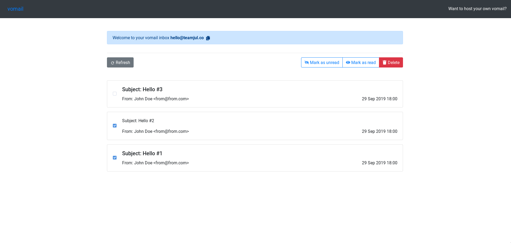

## Vomail

## Why

I needed a dockerized, modern, and open source trash mail solution.

## What

Four containers:

- MariaDB,
- SMTP Server written in Node.JS,
- API written in Node.JS,
- Front-end written in React,

## How to use

- Add a MX record pointing to your domain
- Clone this project on your server
- Edit the docker-compose.yml file to suit your needs
- Run docker-compose up -d
- Done!

Notes:

- You should bind vomail-smtp to port 25
- You should change the MYSQL_ROOT_PASSWORD environment variable
- You should change the API_AUTH_TOKEN and the SMTP_AUTH_TOKEN environment variables. They MUST match.

## Features

- [x] Dockerized :whale:,
- [x] Catch & store all incoming mails,
- [x] REST API to script with,
- Get mail
- Delete mail
- Mark as read/unread
- [x] Nice Web UI,
- [x] Choose random email/get your own,
- [x] Attachments,
- [x] Share-able links,

## Todo

- Handle HTML emails,
- Delete attachments when deleting mail,
- Take a better screenshot/GIF
